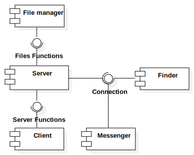

# RandomChat
Un app Android per chattare con sconosciuti. Sviluppata da RMC Inc. per l'Università di Napoli Federico II

## Requisiti
1. Il sistema deve gestire una random chat in cui i clients si collegano ad una stanza tematica e vengono messi in contatto con altri clients in maniera random. I client una, volta accoppiati, possono scambiarsi messaggi testuali fino alla chiusura da parte di una delle parti della chat. Ciascun client èidentificato pubblicamente da un nickname, scelto dall’utente.
2. Permettere all’utente di sapere quanti clients sono connessi in ogni stanza.
3. Permettere all’utente di mettersi in attesadiuna chat in determinata stanza.
4. Una volta stabilito il match permettere all’utente di scambiare messaggi con l’utente assegnato e di chiudere la conversazione in qualsiasi momento.
5. Non essere assegnato ad una medesima controparte nella stessa stanza in due assegnazioni consecutive.
6. Permettere l’invio di messaggi tramite i servizi di speech recognition del client android.
7. Prevedere un tempo massimo di durata di una conversazionedopo il quale si viene assegnati ad un'altra chat
### Requisiti non funzionali
Il server va realizzato in linguaggio C su piattaforma UNIX/Linuxe deve essere ospitato online su un server cloud. Il client va realizzato in linguaggio Java su piattaforma Android e fa utilizzo dei servizi di speech recognition. Client e server devono comunicare tramite socket TCP o UDP. Oltre alle system call UNIX, il server può̀utilizzare solo la libreria standard del C. Il server deve essere di tipo concorrente, ed in grado di gestire un numero arbitrario di client contemporaneamente. Il server effettua il log delle principali operazioni (nuove connessioni, sconnessioni, richieste da parte dei client) su standard output.

# Analisi

## UseCase
I requisiti funzionali elencati sopra possono essere riassunti nei seguenti casi d'uso.

## Classi di Analisi

- WelcomeController si occupa di far scegliere il nickname all'utente e di aprire la comunicazione con il server.
- RoomController si occupa di scaricare dal server le varie stanze e le fa selezionare all'utente
- Chatcontroller si occupa di scambiare i messaggi tra 2 utenti di una stessa stanza

# Progettazione
## ComponentDiagram e scomposizione Top-Down

- Il componente File loader si occupa di leggere le stanze da un file e metterle in una apposita struttura dati
- Il componente Finder si occupa di accoppiare gli utenti di una stessa stanza
- Il componente Messenger si occupa di far scambiare i messaggi a utenti accoppiati
- Server è il componente principale che gestisce gli altri e comunica con il Client

## Statechart
### Server

### Client

## Protocollo di comunicazione
Il client deve connettersi al server tramite socket con protocollo 
tcp-ip. La comunicazione avviene tramite scabio di messaggi testuali di massimo *500 bytes*.

Il primo carattere della stringa inviata rappresenta il comando da far eseguire al server seguito da eventuali argomenti separati da spazi.
Il server utilizza la codifica dei caratteri ASCII.

I comandi interpretabili dal server sono:

- ***ENTER_IN_ROOM*** = 114 ('r')
- ***NEW_ROOM*** = 097 ('a')
- ***ROOM_LIST*** = 108 ('l')

- ***NEXT_USER*** = 110 ('n')
- ***SEND_MSG*** = 109 ('m')

- ***EXIT*** = 101 ('e')

Per eseguire i comandi il client deve essere loggato (vedi sezione sotto).

Il comando ***ENTER_IN_ROOM*** permete di entrare in una stanza.

Il comando ***NEW_ROOM*** permette di creare una nuova stanza.

Il comando ***ROOM_LIST*** permette di ricevere una lista di stanze.

Una volta entrati in una stanza il comando ***NEXT_USER*** permette di 
trovare un nuovo utente con cui chattare.

Il comando ***SEND_MSG*** serve a mandare un messaggio testuale all'utente accoppiato. Al massimo di 498 bytes

Quesi ultimi 2 comandi non sono utilizzabili se il client non è entrato in una stanza e se inviati il server chiuderà la connessione.
Viceversa i primi 3 non sono utilizzabili se il client è entrato in una stanza.

Il comando ***EXIT*** termina la connessione.

Se il primo carattere inviato non corrisponde ad uno di quelli elencati sopra
il server chiuderà immediatamente la connessione.
#### N.b.
Per 'comandi' si intendono caratteri, ad esempio il comando ***EXIT*** rappresenta il carattere 101 in codifica ASCII
(quindi 'e'). Quindi ad esempio nelle sezioni successive quando si fa riferimento alla strigna `ENTER_IN_ROOM user` si intende la stringa `r user`

### Login
Una volta stabilita la connessione il server si mette in attesa per ricevere il nickname
del client. Una volta ricevuto il nickname il server invierà una lista di stanze al client.

Il nickname è associato al client per tutta la durata della connessione.
Per cambiare nickname è necessario chiudere e riaprire la connessione. 
Il nickname è una stringa di massimo 20 caratteri e può contenere spazi e caratteri speciali. Più client possono avere stesso nickname.

> #### Esempio
> Si assuma che il client voglia impostare `John` come proprio nickname.
> 
> Allora è sufficiente inviare la stringa `John` dopo aver stabilito la connessione.

### Entrare in una stanza
Per entrare in una stanza il client deve essere loggato e deve conoscere l'id della stanza
nella quale vuole accedere. Per uscire da una stanza il client deve terminare la connessione tramite
il comando ***EXIT*** o chiudendo il socket di comunicazione. Una volta entrati il server
cercherà un altro utente con cui chattare. Una volta che si è stati accoppiati è possibile inviare il comando ***NEXT_USER*** 
per chiudere la chat e cercare un altro utente con cui chattare oppure usare il comando ***SEND_MSG*** per inviare un messaggio.

Quando il server trova un altro utente invia un messaggio di conferma con il formato 
`ENTER_IN_ROOM nickname` dove nickname rappresenta il nickname dell'altro utente.

Se la stanza è temporizzata il server invierà ai 2 client un messaggio di ***NEXT_USER*** al termine del tempo.

> #### Esempio
> Si assuma di voler entrare nella stanza con id *#1234* e che il server vi accoppi con l'utente di nome John.
> 
> Allora il client dovrà inviare la stringa `ENTER_IN_ROOM 1234`.
> 
> Una volta trovato l'utente, il server risponderà con la stringa `ENTER_IN_ROOM John`.

> #### Inviare e ricevere messaggi
> Si assuma di voler inviare un messaggio per salutare John
> 
> Allora basta inviare la stringa con formato `SEND_MSG msg` ad esempio `SEND_MSG Ciao, come va?`
> 
> Nel caso John vi risponda il server invierà al client una stringa con formato
> `SEND_MSG response` ad esempio `SEND_MSG Tutto bene tu?`

> #### Cercare un altro utente
> Nel caso che la conversazione con John risulti noiosa...
> 
> Allora basta inviare al server la stringa `NEXT_USER`.
> Quando verrà trovato un nuovo utente il server invierà una stringa con formato
> `ENTER_IN_ROOM nickname`

> #### Conversazione terminata
> Nel caso in cui john si sia stancato di voi...
> 
> Il server invierà al client la stringa `NEXT_USER` se John ha terminato la conversazione
> oppure `EXIT` se è uscito dalla stanza o c'è stato un errore di connessione.
> 
> In questo caso il client può inviare o un `NEXT_USER` per cercare un nuovo utente o un `EXIT` per uscire dalla stanza.
> Anche il comando `SEND_MSG` è accettato ma non avrà nessuna conseguenza.
> 

### Creare una nuova stanza
Per creare una nuova stanza bisona scegliere un nome di massimo *30 bytes*, un icona, il colore dell'icona e il colore della stanza in formato rgb.
Nel caso che la stanza sia temporizzata è necessario specificare il tempo di durata massima di ogni chat in secondi.
Icone e colori aiutano a rappresentare il tema della stanza. Le icone sono rappresentate da un intero a 4 bytes e si riferiscono al font standard di android per le icone
reperibili a questo [link](https://github.com/google/material-design-icons).

<link
	rel="stylesheet"
	href="https://material-icons.github.io/material-icons-font/css/all.css"
/>

> #### Esempio  
> Si assuma di voler creare una nuova stanza tematica per studenti di informatica, non temporizzata, con l'icona
> di un computer, colore dell'icona grigia e stanza verde.
> 
> Il codice esadecimale dell'icona di un computer è 0xe30a che in decimale equivale a 58122.
> > <i class="material-icons md-48 md-computer"></i>
>
> Il codice rgb di un grigio chiaro è 0xeeeeee che in formato decimale r.g.b equivale a 238.238.238.
> 
> Quindi il verde sarà 0.255.0.
> 
> Per creare una nuova stanza basta inviare al server una stringa con il seguente formato
> `NEW_ROOM 'room_name' icon r.g.b r.g.b time` dove il primo parametro rgb rappresenta il colore dell'icona e il secondo il colore della stanza.
> 
> La stanza di esempio va creata quindi con la stringa
> `NEW_ROOM 'Studenti di informatica' 58122 238.238.238 0.255.0 0`

### Lista delle stanze
Per il momento il server invia tutte le stanze disponibili al client
ma questa cosa è da rivedere.

> #### Esempio
> Per ricevere la lista delle stanze dal server inviare il comando `ROOM_LIST`
> 
> Il server risponderà con un intero n che rapresenta il numero di stanze da inviare
> seguito da n invii (ogni invio rappresenta una stanza).
> 
> Ogni stanza arriva con il formato `'room_name' icon r.g.b r.g.b time`
